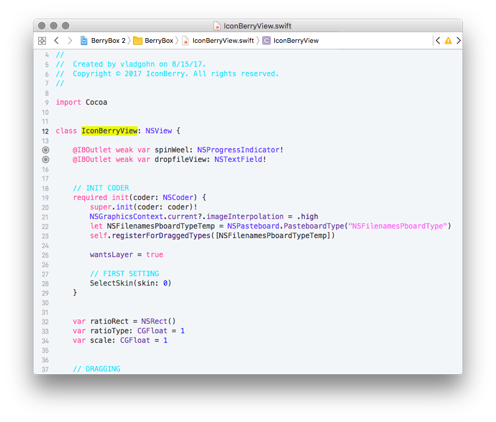

# BerryBox. A light theme for Xcode


## Background

This theme works with Xcode 8 and 9.  
If you would like this theme to work for older versions of Xcode, simply rename the `.xccolortheme` file to be `.dvtcolortheme` instead.

## Download from Git

If you are a git user, you can install the theme and keep up to date by cloning the repo:

```
git clone https://github.com/vladgohn/BerryBox-theme.git
```
## Automatic (via script)

```
./install.sh
```
which will install the file in Xcode **FontAndColorThemes** directory.

## Manual Installation

1.  Download using the [GitHub .zip download](https://github.com/vladgohn/BerryBox-theme/archive/master.zip) option and unzip them.
2.  Create the custom themes folder: `~/Library/Developer/Xcode/UserData/FontAndColorThemes/`
3.  Move `BerryBox.xccolortheme` file to this custom themes folder.

## Activating theme

1.  _Xcode > Preferences > Fonts & Colors_
2.  Select the **BerryBox** theme


### The original [BerryBox theme](https://vladgohn.github.io/BerryBox-theme/) is created by [Vlad Gohn](http://vladgohn.com)


* * *

2018 © Made with <span class="love">♥</span> by [Vlad Gohn](http://vladgohn.com)  
under [MIT license](http://mit-license.org/)

